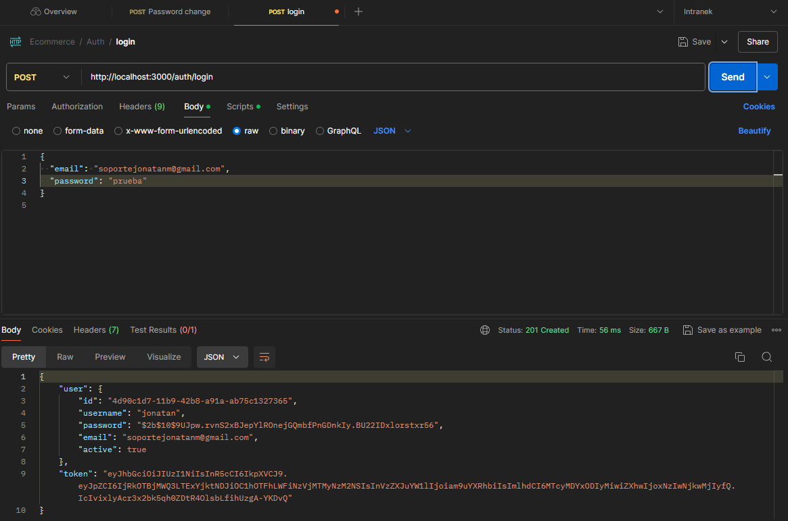
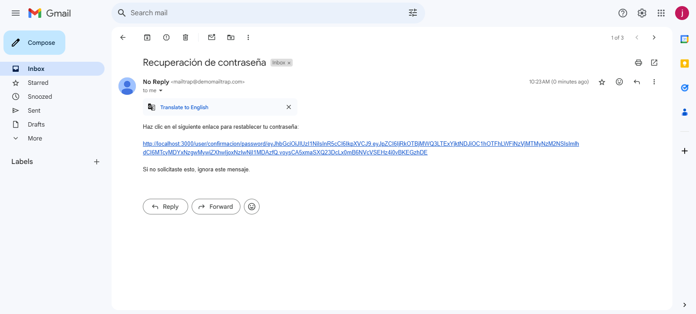
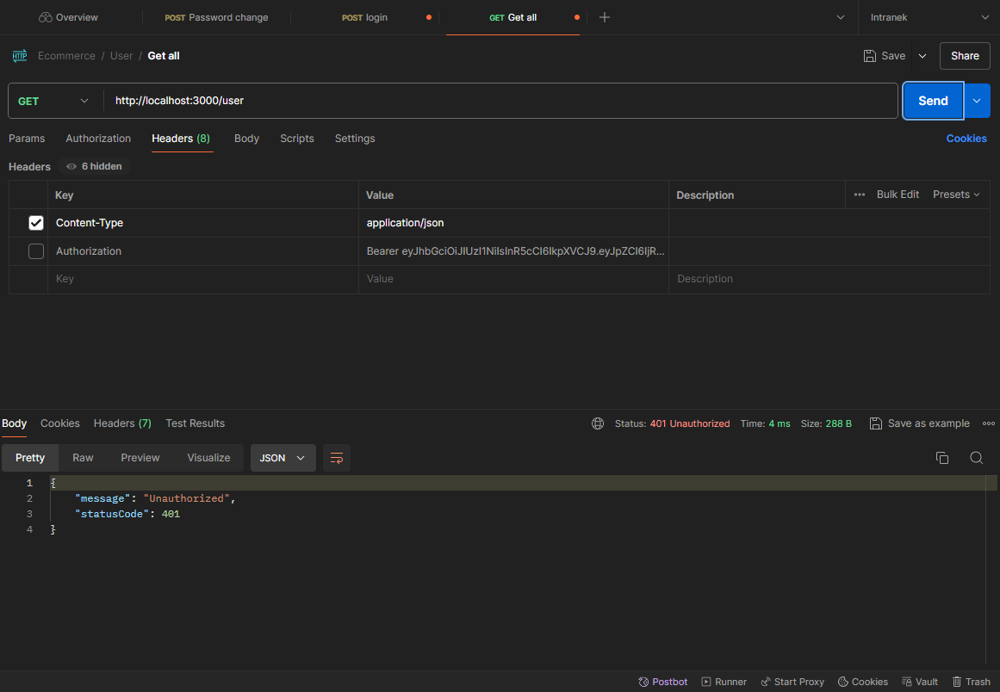

## Proyecto: Inicio de sesión basado en JWT, Passport y Mailer con NestJS.

### Descripción del Proyecto
Se implementó un backend encargado de generar los tokens para iniciar sesión, recuperar la contraseña y verificar tu correo para activar la cuenta. También se integraron rutas protegidas.

### Imágenes

- **Inicio de Sesión**
  

- **Recuperar contraseña**
  

- **Ruta protegida**
  

